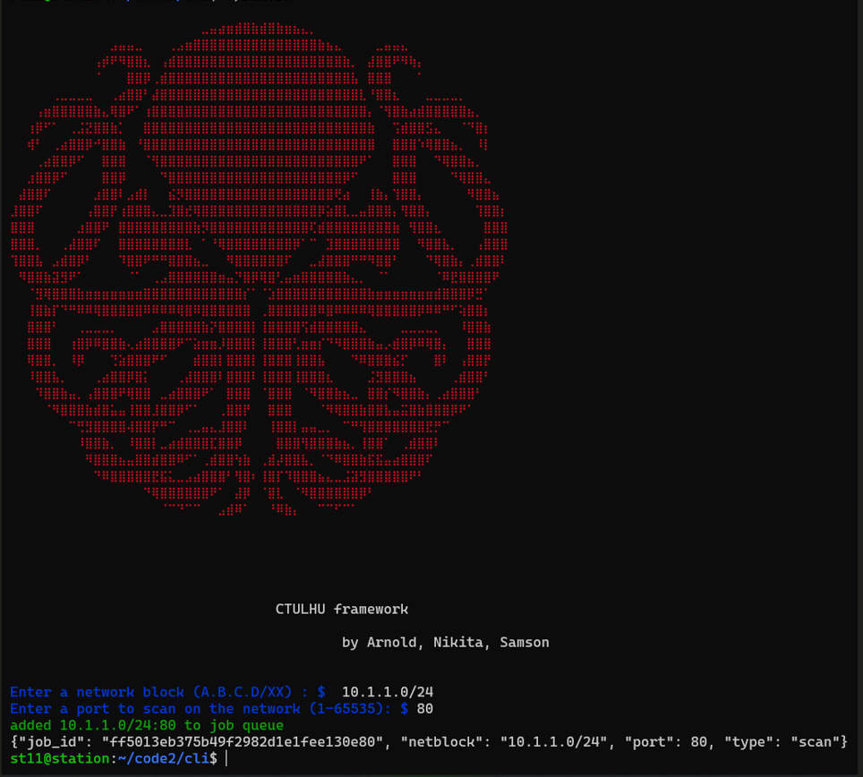
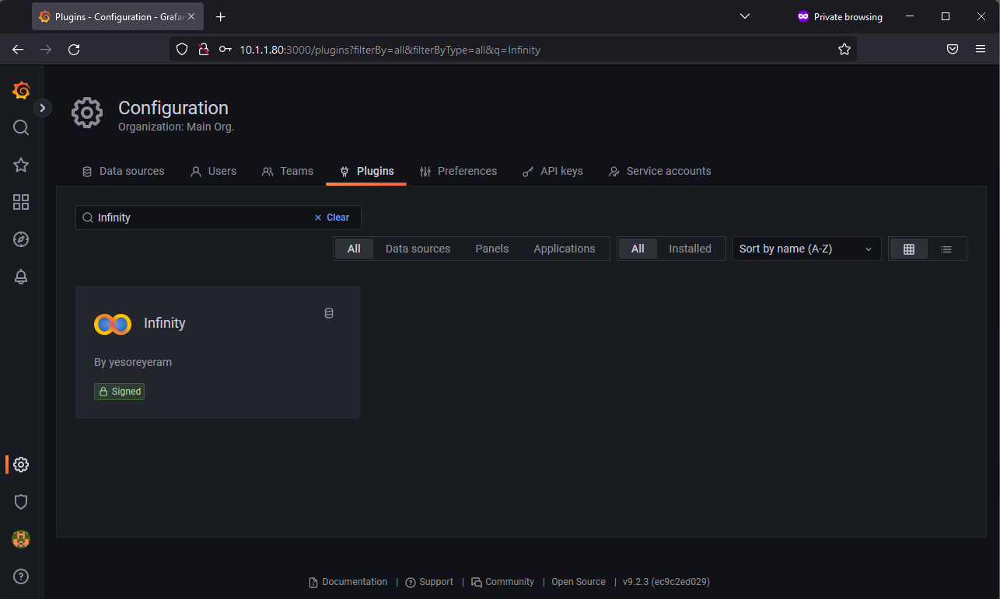

# Cthulu Framework
---





# Intro

CTHULU is a distributed scanner, which spreads the pool of ip addresses to scan over a group of relatively medium capacity devices (horizontal scaling botnet-style), in order to reduce scan time.

Demo: https://youtu.be/mk22sYc7R1o

# Setup


## I. Backend


1. Start `server`, `operator-cli`, `operator-dashboard` services

```sh
$  docker compose up
```

- `server` listens on port `5000` of your host
- `operator-cli` listens on port `5001` of your host
- `operator-dashboard` listend on port `3000` (https) of your host

2. Install Grafana Infinity Plugin, and create default infinity DataSource

-  Search for Infinity Plugin




- Install Infinity Plugin


- Create Infinity DataSource


3. Import the json dashboard `./operator/BotNet Master.json` 


After import you should obtain this dashboard. Not the most creative but i bet you can customize it and make pull request )).


## II. Bot client

  
1. Change ip address of server in `./bot/main.go`

```go
func main() {
    sys := &bot.LinuxSystem{}
    sys.Init()
    tasker := bot.TaskerProxy{Url: "http://server:5000"}
    tracker := bot.TrackerProxy{Url: "http://server:5000"}
```

2. Build the bot client binary
  

```sh
$ ls
bot  go.mod  main.go
$ go mod tidy
$ go build -o botclient .
$ ls
bot  botclient  go.mod  main.go
$

```

  

2. Copy and Run the `botclient` binary to workstations you want to use as `WorkerBots` within your network.


## III. Monitor bots added to pool


## IV. Provide ip subnets to scan and monitor

To connect as an operator and schedule scan jobs, connect to the operator cli on port `5001`


# Architecture (at least the intended  on :) )


# Uml Modelling


  

# TODO:

  
- Add nginx reverse-proxy to `docker-compose.yml`
